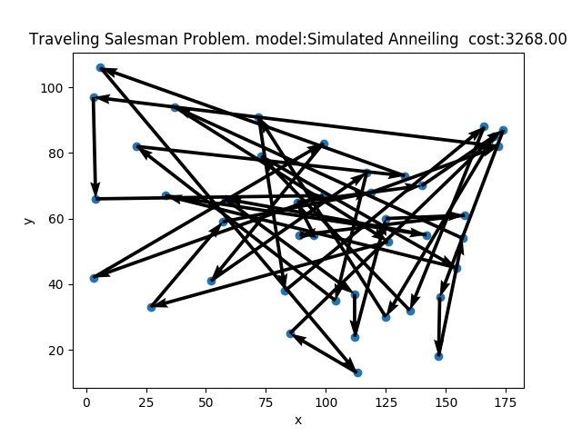

# Approximate Optimization Methods
This repo contains some of the methods you can use to approximate hard optimization problems, like the Traveling Salesman Problem (TSP)

## Simulated Anneiling
Simulated Anneiling is stochastic method based on the physical process of Anneiling, where metals are heated and then slowly cooled in order to recrystalize the metal.

For hot metals, more crystal structures are possible, so by cooling the metal, the possible crystal structures decreases, until it is locked in the final form. By controling the cooling, the idea is that the probability of ending in the lowest energy state using a random walk, is proportional to how slow the cooling is.

In simulated anneiling, you generate solutions by randomly permuting the current solution, and accepting it if it's better. The anneiling part is introduced, by also accepting worse solutions, with a probability proportional to the "temperature" which is slowly lowered. This allows for more exploration in the begining, which hopefully means, that as we gradually move to more exploration, the probability of converging to the global optima is high

## Genetic Algoritm
The Generic Algorithm is part of the class of evolutional algoritms, which also are inpired by nature. As we know, evolution has been the workhorse behind most of the wonders in nature, essentially by optimizing the overall fitness of a population.

This has inspirred the formulation of methods like the genetic algorithm, where the fitness of a population is optimized, by four processes:

1. Selection, where the fittest individuals are more likely to pass on their genes
2. crossover, where the genes of two individuals are combined, in order to create new offspring
3. mutations, where genes of offspring is randomly permuted, in order to introduce new features
4. termination, where unfit individuals are more likely to not suvive the genetation

# Self Organizing Maps (SOM)
https://diego.codes/post/som-tsp/

# Quantum Adiabatic Optimzation
https://www.frontiersin.org/articles/10.3389/fphy.2014.00005/full